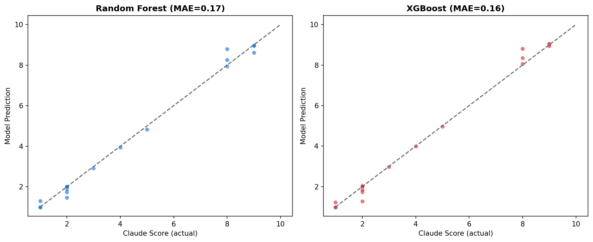
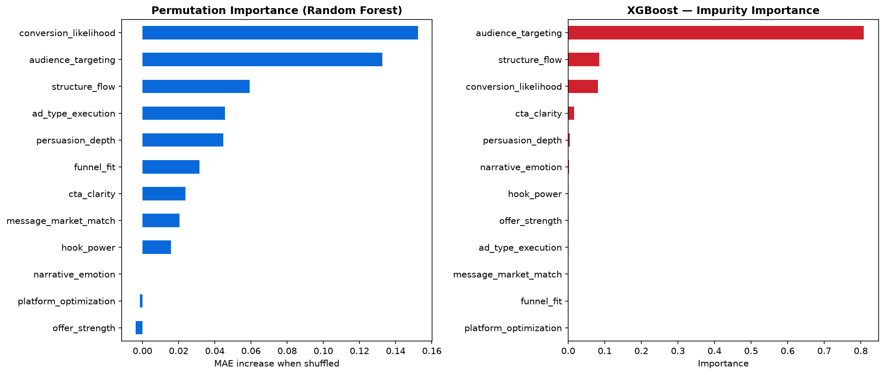

# brain-ad-scorer

**Scores marketing ads before you spend money on them.**

Paste ad copy or upload the creative itself. A hand-written analysis engine runs
deterministic checks locally, an expert-persona LLM grades 12 dimensions, two ML models
predict overall impact from those grades, and break-even math runs against your margins.
Out comes a verdict: **RUN it**, **FIX it first**, or **DON'T RUN it**.

[](https://github.com/ianwright547/brain-ad-scorer/actions/workflows/ci.yml)
[](LICENSE)


**[Live app](https://mladscorer.netlify.app)** · **[2-minute walkthrough](https://www.loom.com/share/839d9cc3fec545ada3fa94633cb772ba)** · **[API health](https://brain-ad-scorer.fly.dev/health)** · **[Engineering notes](docs/ENGINEERING_NOTES.md)**

> The free **pre-flight** analysis on the live app runs without a key. Full LLM scoring is
> behind an access code so the API bill stays mine — the Loom shows it end to end.
> The backend sleeps when idle, so the first request takes a few seconds to wake.

---

## What I actually built

The easy version of this project is a form that forwards text to an LLM. Most of the work
here is the part that runs *without* the API.

**Deterministic text pre-flight** — [`analysis/text_features.py`](analysis/text_features.py)
Flesch Reading Ease and Flesch–Kincaid grade implemented from the published formulas,
including a hand-written syllable counter (contiguous vowel groups, silent-`e` correction,
floor of one). Curated copywriting lexicons, plus regex detection of CTAs, dollar/percent/
timeframe specificity, and risk-reversal language. Runs in under a millisecond and costs
nothing, so it gates the paid call the way a linter gates CI.

**Pixel-level image inspection** — [`analysis/image_features.py`](analysis/image_features.py)
Raw bytes in, computer-vision metrics out, with numpy convolutions written by hand and no
OpenCV: Laplacian variance (the classic blur detector), Sobel edge density, RMS contrast,
BT.601 luma brightness, and the Hasler–Süsstrunk colorfulness metric. File type is
identified from magic bytes rather than trusting the extension, and dimensions are checked
against real platform specs.

**Content-addressed caching** — [`app/db.py`](app/db.py)
Every LLM response is cached in SQLite under `SHA-256(prompt version + exact input)`.
Identical input never bills twice, and editing the persona prompt changes the version hash,
which invalidates every stale entry automatically. Cache invalidation is designed away
instead of managed.

**Models measured against baselines, not vibes** — [`scripts/train_model.py`](scripts/train_model.py)
Random Forest and XGBoost are scored against a dummy mean-predictor (the floor) and linear
regression (does this relationship even need trees?). It does need them. Feature importance
is permutation-based on held-out data, not impurity.

## Architecture

```
ad copy and/or image ──► FastAPI
                           │
        ┌──────────────────┼───────────────────────┐
        ▼                  ▼                       ▼
  text preflight     image inspector        SQLite cache
  (readability,      (sharpness, contrast,  (SHA-256 of input +
  lexicons, regex —  colorfulness — raw     prompt version;
  no API, <1ms)      pixels via numpy)      hit = $0, instant)
        │                  │                       │ miss
        │                  │                       ▼
        │                  │              Claude API (text or vision)
        │                  │              grades 12 expert dimensions
        │                  │                       │
        │                  │         ┌─────────────┴────────────┐
        │                  │         ▼                          ▼
        │                  │   Random Forest              XGBoost
        │                  │   (dimensions → overall impact score)
        │                  │         │                          │
        └──────────────────┴─────────┴──────────┬───────────────┘
                                                ▼
                                 break-even math vs your margins
                                                ▼
                                    RUN / FIX FIRST / DON'T RUN
```

## Model performance

12 expert-graded dimensions → `overall_impact`, trained on 30 real ad transcripts
(24 train / 6 test, 5-fold CV on the full set).

| model         | CV MAE          | CV R²           | holdout MAE | holdout R² |
|---------------|-----------------|-----------------|-------------|------------|
| dummy (mean)  | 1.53 ± 0.42     | −0.79 ± 0.78    | 1.28        | −0.96      |
| linear        | 0.68 ± 0.32     | 0.57 ± 0.41     | 0.32        | 0.84       |
| **random forest** | **0.46 ± 0.16** | **0.86 ± 0.10** | **0.31** | **0.88** |
| xgboost       | 0.52 ± 0.05     | 0.74 ± 0.17     | 0.34        | 0.75       |

Random Forest lands within 1 point of the expert score on 100% of held-out ads, and within
0.5 points on 83%. Permutation importance says the verdict is driven mostly by
`conversion_likelihood` and `audience_targeting` — hook quality matters less than ad gurus
claim, at least in this dataset.

<p align="center">
  
  
</p>

## API

| method | route      | what it does                                                            |
|--------|------------|-------------------------------------------------------------------------|
| POST   | `/score`   | full evaluation — copy and/or base64 image, optional business economics  |
| POST   | `/analyze` | deterministic text pre-flight only — free, no API call                  |
| GET    | `/history` | recent evaluations from SQLite                                          |
| GET    | `/health`  | liveness + active prompt version                                        |

```bash
curl -X POST https://brain-ad-scorer.fly.dev/analyze \
  -H "Content-Type: application/json" \
  -d '{"ad_copy":"Get 50% off in the next 24 hours. 30-day money-back guarantee."}'
```

## Run it locally

```bash
# backend
git clone https://github.com/ianwright547/brain-ad-scorer.git
cd brain-ad-scorer
python -m venv venv
source venv/bin/activate      # Windows: .\venv\Scripts\activate
pip install -r requirements.txt
cp .env.example .env          # add your Anthropic API key
uvicorn app.main:app --reload

# frontend (separate terminal)
cd frontend
npm install
echo "VITE_API_URL=http://localhost:8000" > .env.local
npm run dev
```

## Tests

33 tests: the syllable counter and readability math, lexicon matching, image metrics
(verified against generated fixtures with known properties), cache hit/miss and prompt
invalidation, plus API tests with the LLM call mocked. GitHub Actions runs `ruff` and
`pytest` on every push.

```bash
pip install -r requirements-dev.txt
pytest
```

## Honest limitations

- 30 labeled samples is small. The metrics are real, but the confidence intervals are wide
  — more labeled ads is the single highest-leverage improvement.
- The ML models distill the LLM's own weighting function, not independent ground truth. The
  comparison measures agreement, not ad performance. Validating against real CTR/CPA data
  is the obvious next step.
- The estimated CPA range in the profitability engine is an industry heuristic, clearly
  labeled as such in the UI — not a model prediction.
- Cache and history live in SQLite on the deployed container with no attached volume, so
  they reset on restart. Fine for a demo, not for production.

## Stack

Python 3.11 · FastAPI · scikit-learn · XGBoost · numpy · Pillow · SQLite · Claude API ·
React · Vite · pytest · ruff · GitHub Actions · Fly.io · Netlify

## Repo map

```
analysis/   deterministic engines — text_features.py, image_features.py
app/        FastAPI service (main.py) + SQLite persistence (db.py)
scripts/    data labeling and model training
prompts/    expert persona system prompt + scoring rubric
models/     trained Random Forest and XGBoost artifacts
frontend/   React + Vite client
tests/      pytest suite (LLM mocked, DB redirected via SCORER_DB)
docs/       engineering notes — design decisions, in detail
```

---

MIT licensed. Built by [Ian Wright](https://github.com/ianwright547) —
CS @ Indiana University.
